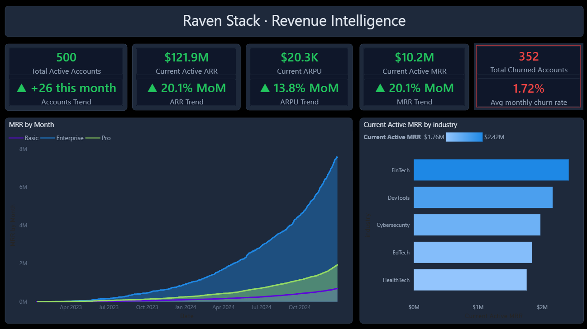
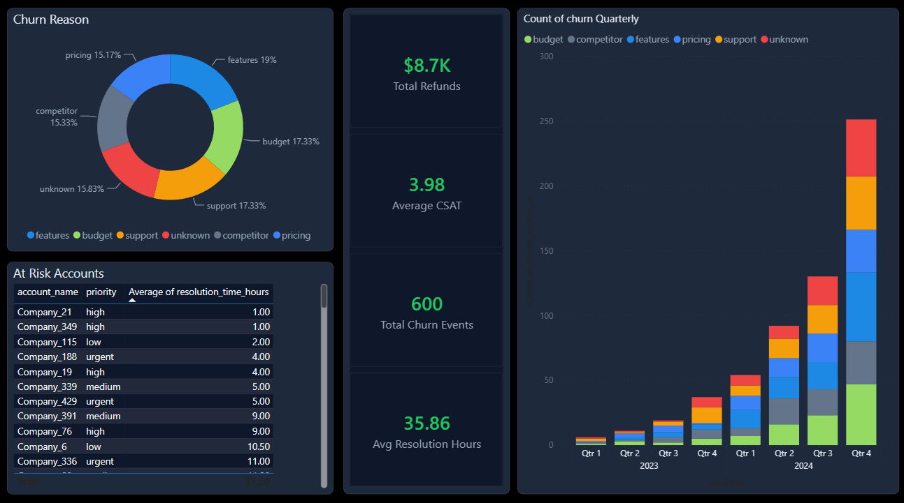
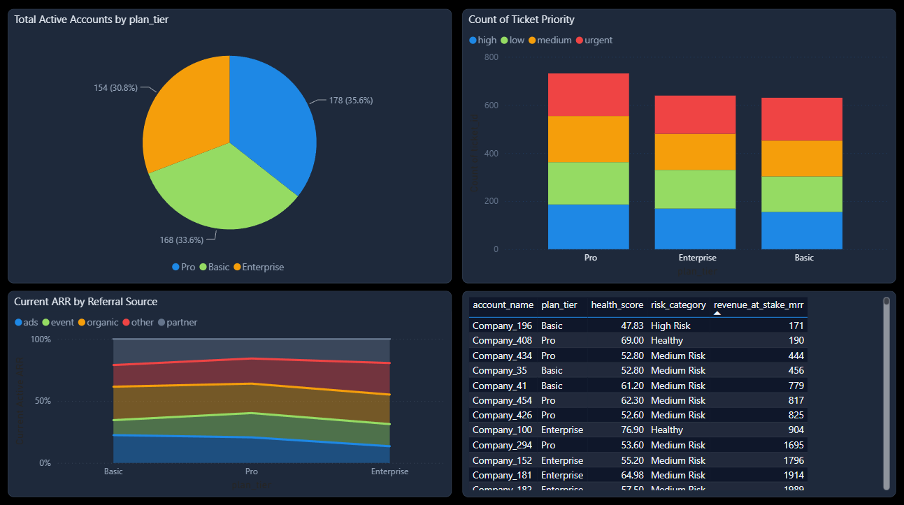
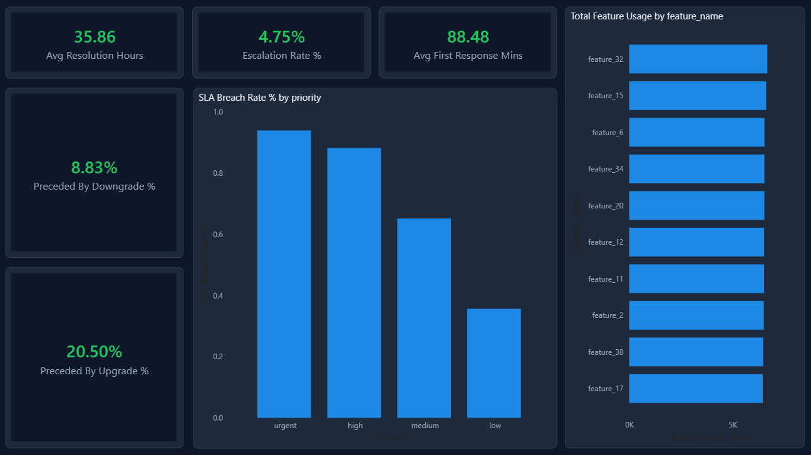

# RavenStack — SaaS Revenue Intelligence System

Built as a portfolio project to demonstrate end-to-end analytics work — from database schema design through to a published Power BI dashboard. The dataset is synthetic SaaS data (500 accounts, 5 tables), covering SQL analytics, DAX measures, and customer health scoring.

---

## Dashboard Preview

| Page 1 — Revenue Overview | Page 2 — Churn Analysis |
|---|---|
|  |  |

| Page 3 — Account Intelligence | Page 4 — Product & Support |
|---|---|
|  |  |

---

## Tech Stack

- **Database** — PostgreSQL 16
- **Analytics** — SQL (CTEs, window functions, GENERATE_SERIES)
- **Visualisation** — Power BI Desktop 2.155 (2026)
- **Measures** — DAX (20+ measures, conditional formatting, MoM trends)
- **Data prep** — Power Query M

---

## Project Structure

```
ravenstack-revenue-intelligence/
│
├── ravenstack_analysis.sql          # All SQL sections (schema + analytics)
├── Customer_Risk_Register_clean.csv # 500-account health register output
│
├── powerbi/
│   └── RavenStack_Dark_Theme.json   # Power BI dark theme
│
├── dax/
│   └── measures_reference.md        # DAX measures with explanations
│
├── screenshots/
│   ├── page1_revenue_overview.png
│   ├── page2_churn_analysis.png
│   ├── page3_account_intelligence.png
│   └── page4_product_support.png
│
├── data/
│   └── README.md                    # Download instructions for raw CSVs
│
└── README.md
```

---

## Dataset

**RavenStack** — a synthetic multi-table SaaS dataset by **River @ Rivalytics**.

> Credit: River @ Rivalytics. Used for educational and portfolio purposes.  
> Dataset: https://rivalytics.medium.com

| Table | Rows | Description |
|---|---|---|
| accounts | 500 | Company, industry, plan tier, signup date |
| subscriptions | 5,000 | MRR, ARR, upgrade/downgrade flags, billing frequency |
| feature_usage | 24,979 | 40 features tracked by usage count, duration, errors |
| support_tickets | 2,000 | Resolution time, priority, CSAT, escalation flag |
| churn_events | 600 | Churn date, reason code, refund, reactivation flag |

**Industries:** FinTech · DevTools · Cybersecurity · EdTech · HealthTech  
**Plan tiers:** Basic · Pro · Enterprise  
**Date range:** Jan 2023 – Dec 2024  
**Countries:** 7

---

## SQL Sections (`ravenstack_analysis.sql`)

| Section | What it does |
|---|---|
| 1 — Schema DDL | Creates all 5 tables with correct data types, FK constraints, NULLability |
| 2 — Data loading | COPY commands with placeholder paths (update before running) |
| 3 — Core KPIs | MRR, ARR, ARPU, monthly churn rate, NRR in a single query |
| 4 — Cohort retention | Monthly cohort matrix (m0 through m6) using GENERATE_SERIES |
| 5 — MRR waterfall | New · Expansion · Contraction · Churned MRR using CROSS JOIN + LAG() |
| 6 — Revenue by segment | MRR/ARR split by industry and plan tier |
| 7 — Account health scores | Composite score: usage 40% · CSAT 30% · errors 15% · escalation 15% |
| 8 — Customer risk register | One row per account using DISTINCT ON — handles multi-subscription accounts |
| 9 — Feature adoption | Top features by usage, split by plan tier and beta flag |
| 10 — Support SLA | Avg resolution, first response, escalation rate, SLA breach % by priority |
| 11 — Upgrade/downgrade funnel | Plan movement counts and MRR impact by industry |
| 12 — Churn deep-dive | Reason × plan tier cross-tab, reactivation rate, preceding plan change flags |

---

## Power BI Dashboard

The dashboard runs across 4 pages with 23 visuals and 20+ DAX measures.

### Page 1 — Revenue Overview
KPI cards for MRR, ARR, ARPU, active accounts, and churned accounts — each with MoM trend labels and conditional colour formatting. Includes an MRR growth line chart by plan tier and an active MRR bar chart by industry.

### Page 2 — Churn Analysis
Churn reason donut, stacked bar chart by quarter and reason code, a reason × plan tier matrix, at-risk accounts table, and reactivation rate KPI.

### Page 3 — Account Intelligence
Accounts by plan tier, upgrade vs downgrade bar chart, ARR by referral source, and the customer health register table with conditional score colouring.

### Page 4 — Product & Support
Top 10 features by usage, SLA breach rate by priority, resolution time and escalation KPIs, and a breakdown of how many churns were preceded by a plan change.

---

## How to Run

### Prerequisites
- PostgreSQL 16+
- Power BI Desktop (any 2024+ version)

### Step 1 — Database setup
```sql
CREATE DATABASE ravenstack_analytics;
```
Connect to `ravenstack_analytics` then run `ravenstack_analysis.sql`.

> Before running, find the 5 COPY commands near the top of the SQL file and update the paths to point to your local data folder.

### Step 2 — Load data
Download the raw CSVs from the dataset source (see `/data/README.md`) and place them in your data folder. Run the COPY section of the SQL script.

### Step 3 — Power BI
1. Open Power BI Desktop → Get Data → PostgreSQL → connect to `127.0.0.1 / ravenstack_analytics`
2. Import all 5 tables
3. View → Themes → Browse for themes → select `powerbi/RavenStack_Dark_Theme.json`
4. Create a `_Measures` table and add all DAX measures from `dax/measures_reference.md`

---

## What the Data Shows

A few things stood out during the analysis:

- **Feature gap (19%)** is the leading churn reason — a product fit signal rather than a pricing one
- **20.5% of churns followed an upgrade** — suggesting an upgrade → disappointment → churn pattern worth investigating
- **Enterprise accounts** carry the highest MRR concentration and, by extension, the highest churn risk
- **FinTech leads** active MRR by industry; organic and partner channels produce the highest-value accounts
- SLA breach rates are elevated across all priorities — this is a data generation artifact, noted in the limitations below

Active ARR: **$121.92M** · MRR: **$10.16M** · ARPU: **$20.3K**

---

## Known Limitations

| Issue | What's happening |
|---|---|
| December 2024 churn spike | The dataset generator front-loaded 96 churns into Dec 2024, producing a 20.25% monthly rate. The analysis focuses on reason codes rather than the absolute figure. |
| SLA breach rates | All priority tiers show high breach rates because the generator set avg resolution at ~36h regardless of ticket priority. Not a real pattern. |
| Enterprise-heavy risk register | Multi-subscription accounts get assigned the highest plan tier via DISTINCT ON, which skews the distribution in `Customer_Risk_Register_clean.csv`. |

---

## Author

**Sumit Kuskar** — Data Analyst   
[LinkedIn](https://linkedin.com/in/sumitkuskar)

---

## Credits & Licence

Dataset: **RavenStack** by River @ Rivalytics — [rivalytics.medium.com](https://rivalytics.medium.com)  
Used under MIT-like licence for educational and portfolio purposes. All data is fully synthetic — no real PII.
